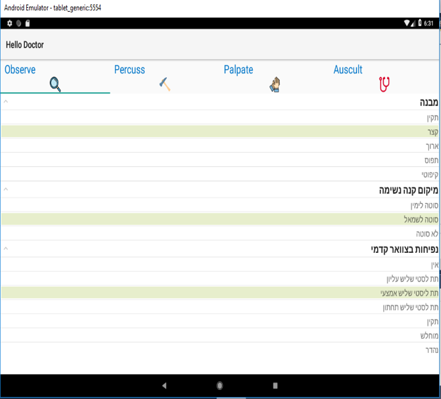
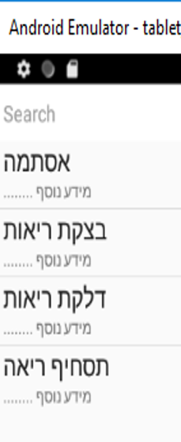

# Portable-system-for-medical-diagnosis 
An example from my project,using xamarin native for android development. 
in the example  i used native user interface controls (widgets) and layouts provided by android. 
such as: 
 tab layout with fragments, searching items in listview,expandablelist, toolbar and  more. 

 

